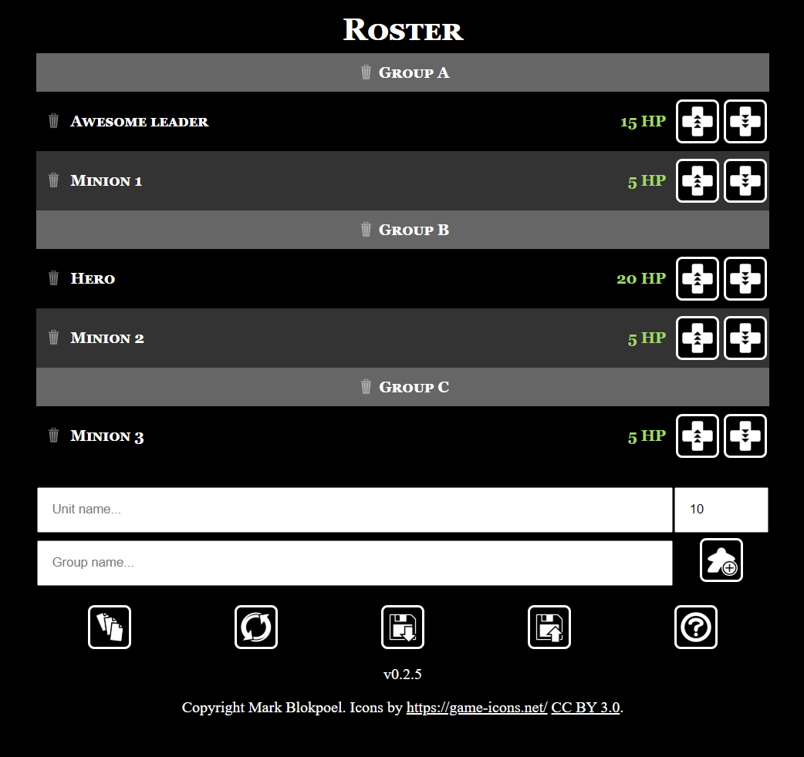

# Simple damage tracker for boardgames
Use this tracking to add the roster of members of your favorite warband. The goal is to keep it simple. Currently works best for games where units have low HP.

Start using the tracker here: [https://markblokpoel.github.io/hptracker/](https://markblokpoel.github.io/hptracker/).

You can grab a URL for each roster you add to store it. Save it as a bookmark, or copy it somewhere easy.

## Tutorial

- Add units using the text boxes for name, group, and HP. You can press enter or use the button to confirm. Units with the same name automatically have unique numbers added. If you leave the group empty, units will be added to " default" group and are automatically listed without a group.
- Add or subtract 1 HP using the buttons on the right of the unit. HP cannot go below 0. You can revive units by adding HP again.
- Delete a single unit or an entire group using the trash can.
- The five buttons at the bottom allow you to:
  - Start a new roster.
  - Reset HP to starting values.
  - Import a roster from BattleScribe or HP Tracker format (see example below)
  - Save the roster URL. Bookmark this URL to save your roster.
  - Go to this help document.

Example roster via URL:
[https://markblokpoel.github.io/hptracker/?names=Awesome%20leader,Hero,Minion,Minion,Minion&groups=Main,Main,Side,Side,Side&hps=15,20,5,5,5](https://markblokpoel.github.io/hptracker/?names=Awesome%20leader,Hero,Minion,Minion,Minion&groups=Main,Main,Side,Side,Side&hps=15,20,5,5,5)

### Import
Import is currently in beta, please report any issues. You can import a BattleScribe roster copied to text. Make sure you've enabled *Inline Profiles*, otherwise the hitpoint information is missing and the import will fail. You can also import a roster using the following simple format:

	# Group A
	- Awesome leader, 15
	- Minion, 5
	
	# Group B
	- Hero, 20
	- Minion, 5
	
	# Group C
	- Minion, 5

## Copyrights
This software is licensed under GNU GPL v3.

Icons by [Game-Icons.net](https://game-icons.net/) CC BY 3.0

Example in figure based on a warband from Warcry by Games Workshop, copyright is theirs. This software is not affiliated with any game, brand or publisher.
